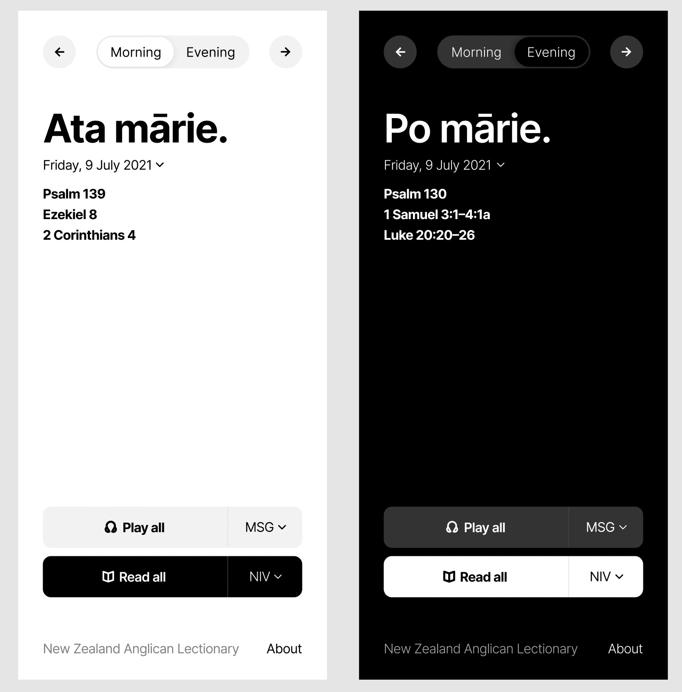

# Lectionary
Code bits for me and Isaac's project to make the NZ Anglican MP and EP Lectionary readings more digitally accessible.  It mostly started for my own personal use, but we're hoping to make it accessible to more people (if we can get permission).

The idea is to have a page that gives the morning prayer and evening prayer readings, with links that take you to read or listen to them at BibleGateway.com.

### Concept design

## Project summary
A main chunk of work has been just manually extracting all the rules from their original PDF into a [Google Sheet](https://docs.google.com/spreadsheets/d/1JFiANpqO4W3UrVBemTetsOfYA5ITnPmDnNq_e1P8qBs/edit#gid=1638477179) and then summarising this years readings into this [Google Sheet](https://docs.google.com/spreadsheets/d/1TE7UzbJG-JJQVM-m1pY8Yc_hSD5zQMfR_d79PDxniZc/edit).

Then the first proof-of-concept was a [google doc](https://docs.google.com/document/d/1tlcsKeXkCpYplauIEDckDrMstBSyR-p3dR-S7aCu5UM/edit) (backed by a google script that reads that second google sheet and refreshes the page every day).

Me and Isaac are now looking at making a proper website (so we can have dark-mode and preferences etc).

### About the data
Most readings were constructed from the Church of England's [The Common Worship Weekday Lectionary](https://www.churchofengland.org/sites/default/files/2017-11/weekday%20lectionary%202005.pdf), and cross referenced with the current NZ Anglican lectionary (available [here](https://www.anglican.org.nz/Resources/Worship-Resources-Karakia-ANZPB-HKMOA/Lectionary-and-Related)) to ensure it matches.

I manually extracted all the rules from their original PDF into a [google sheet](https://docs.google.com/spreadsheets/d/1JFiANpqO4W3UrVBemTetsOfYA5ITnPmDnNq_e1P8qBs/edit).

Then using that rules data, I manually pulled together the morning and evening readings for 2021 so that they matched the Lecitonary published this year, and published it in this [google sheet](https://docs.google.com/spreadsheets/d/1TE7UzbJG-JJQVM-m1pY8Yc_hSD5zQMfR_d79PDxniZc/edit)
(I'm planning to automate this bit later, so the following years don't need to be done manually).

Holy Week readings were taken from NZ Anglican Lectionary (I couldn’t work out where they came from).

Sunday MP and EP readings haven't been done yet.

#### Some decisions I've made (for simplicity)
* I’ve only included the main Psalm
* I’ve excluded readings from the Apocrypha
* Where some verses were optional, I mostly included them. 
* For readings for special celebrations, I have opted to show them on the actual day, rather than the "celebrate on Sunday" option.
* For the the audio version, BibleGateway plays the whole chapter, rather than being able to specify the verses. 
    * And where some of the readings span multiple chapters, we just play the first one (it is likely that the next day will play the next one anyway).

## Folders
### "website"
Should be self-explanatory.

### "jupyter"
For converting the google sheet data into a json object that can be imbedded in an HTML page, and anything else I might want python for.  

If you've got Docker installed, you should be able to run the powershell script `run.ps1` (or if you don't have powershell, copy paste the command in the file into your command line) to get Jupyter running, then if you visit the url in the command line, you'll be able to run / make new notebooks to run.

There's a `stop.ps1` because AFAIK, `ctrl + c` should stop the container, but it doesn't seem to be working for me...?
